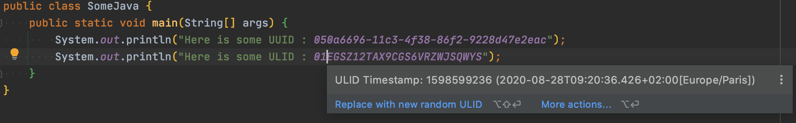
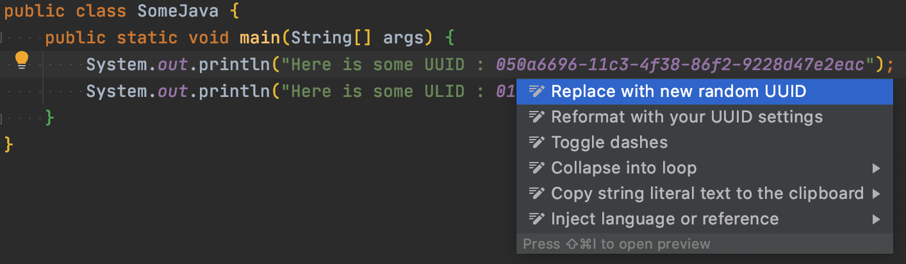
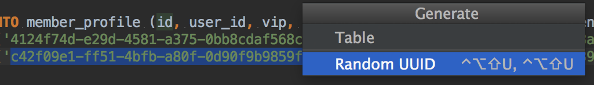
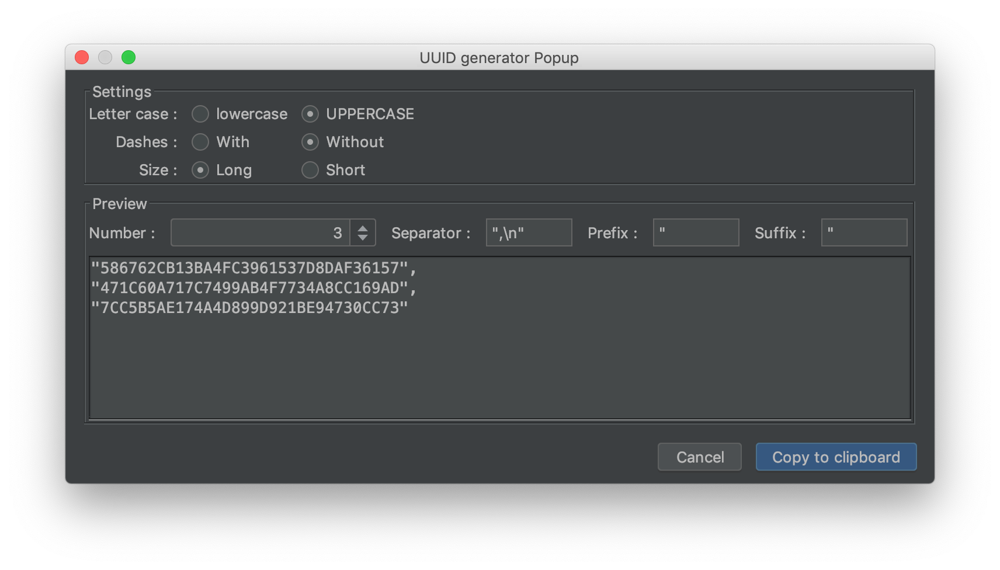
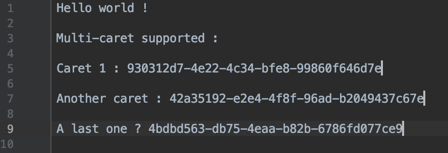
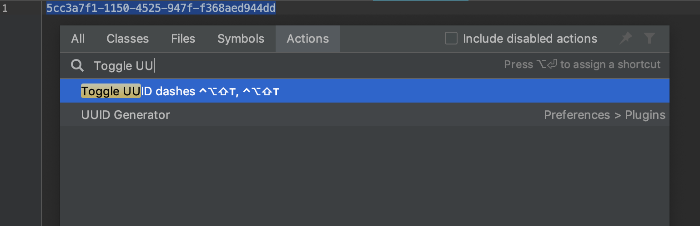
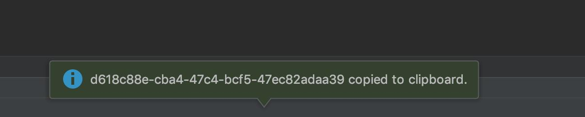
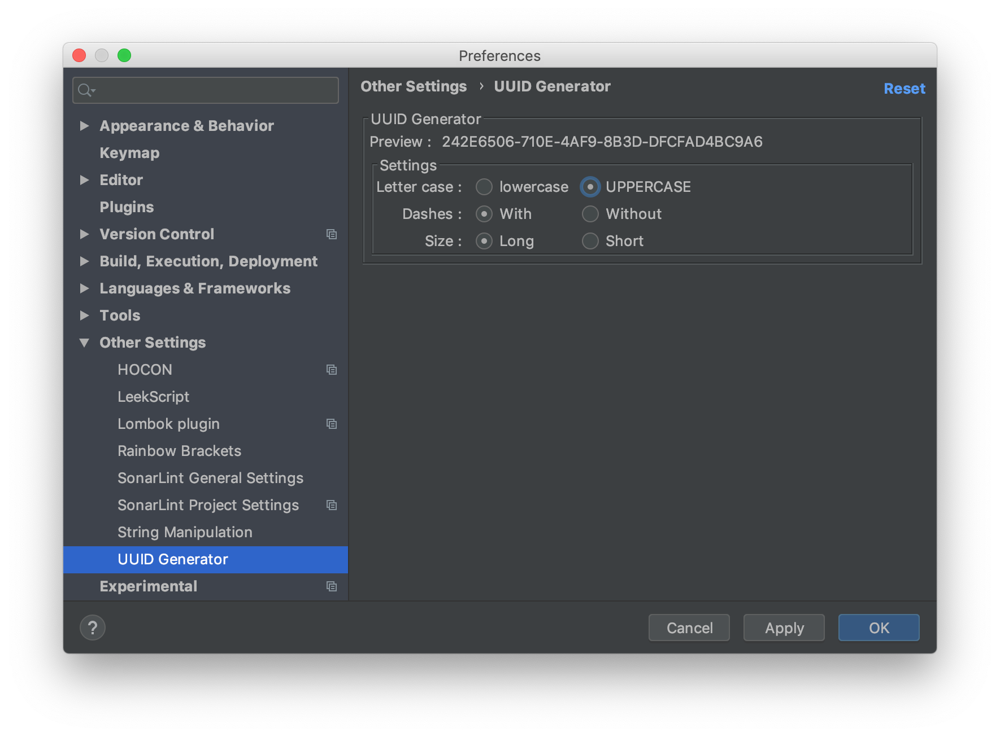
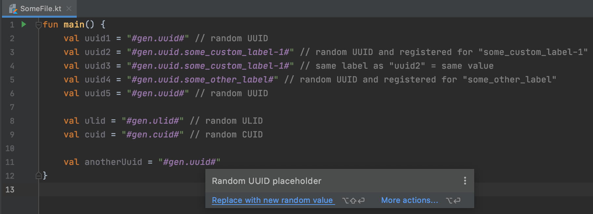
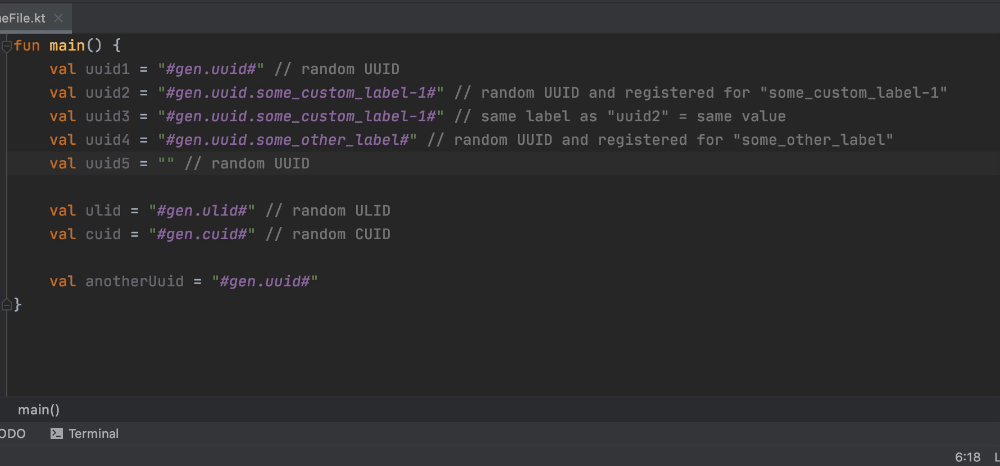

    <a href="https://plugins.jetbrains.com/plugin/8320-uuid-generator">
        </img>
    </a>

<h1 align="center">Intellij UUID Generator</h1>

<a href="https://tools.ietf.org/html/rfc4122">UUID</a>, <a href="https://github.com/ulid/spec">ULID</a> and <a href="https://github.com/ericelliott/cuid">CUID</a> generator plugin for IntelliJ based IDEs.

    
    
    
    
    
    

## JetBrains plugin

Link to the official plugin page : [UUID Generator](https://plugins.jetbrains.com/plugin/8320-uuid-generator)

## Screenshots

* UUID / ULID / CUID highlight

* UUID / ULID / CUID quick fixes

* Random UUID

* UUID Generate Popup

* Multi-caret support

* Toggle dashes

* UUID to clipboard

* UUID format settings dialogue

* ID placeholders highlight

* ID placeholders replacement action

